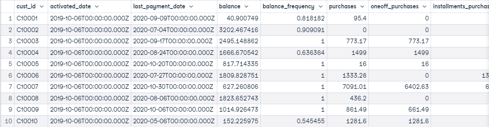

# For this challenge we will use a fake credit card dataset that is attached as df.csv.
which includes information from a public Kaggle dataset with three added fields: activated_date,
last_payment_date and fraud.


## Going to start by importing the libraries im going to use.

```python
import pandas as pd
import numpy as np
import matplotlib.pyplot as plt
import seaborn as sns
```


## We import import the file while parsing date columns we'll use later.

```python
df = pd.read_csv('Stori_Data_Challenge.xls', index_col =0, parse_dates=['activated_date', 'last_payment_date'])
df.head()
```


We use describe method to get statistics and sumatized values. We can see that there are 8950 rows. In the balance column We can see that the min value is 0 and max 119043. This means values are spread by a big amount.

```python
df.describe()
```


```python
df.dtypes
```
```python

cust_id                                     object
activated_date                      datetime64[ns]
last_payment_date                   datetime64[ns]
balance                                    float64
balance_frequency                          float64
purchases                                  float64
oneoff_purchases                           float64
installments_purchases                     float64
cash_advance                               float64
purchases_frequency                        float64
oneoff_purchases_frequency                 float64
purchases_installments_frequency           float64
cash_advance_frequency                     float64
cash_advance_trx                             int64
purchases_trx                                int64
credit_limit                               float64
payments                                   float64
minimum_payments                           float64
prc_full_payment                           float64
tenure                                       int64
fraud                                        int64
dtype: object

```

## We check for missing values. We will use cash_advance later so We will inpute it.

```python
df.isnull().sum()
```
Looking good, but something seems off...
```python
cust_id                               0
activated_date                       13
last_payment_date                     9
balance                               2
balance_frequency                     0
purchases                             0
oneoff_purchases                      0
installments_purchases                0
cash_advance                        112
purchases_frequency                   0
oneoff_purchases_frequency            0
purchases_installments_frequency      0
cash_advance_frequency                0
cash_advance_trx                      0
purchases_trx                         0
credit_limit                          1
payments                              0
minimum_payments                    321
prc_full_payment                      0
tenure                                0
fraud                                 0
dtype: int64
```

```python
df.fillna(method ='ffill', inplace = True) 
df.isnull().sum()
```
Looking good, but something seems off...
```python
cust_id                             0
activated_date                      0
last_payment_date                   0
balance                             0
balance_frequency                   0
purchases                           0
oneoff_purchases                    0
installments_purchases              0
cash_advance                        0
purchases_frequency                 0
oneoff_purchases_frequency          0
purchases_installments_frequency    0
cash_advance_frequency              0
cash_advance_trx                    0
purchases_trx                       0
credit_limit                        0
payments                            0
minimum_payments                    0
prc_full_payment                    0
tenure                              0
fraud                               0
```

## Lets create a histogram to chart how is the balance distributed. With this plot we can see that most people less than 5000 on their balance accounts. A good way to visualize this would be a boxplot.


```python
sns.set_theme()
sns.displot(df.balance,bins=20)
plt.show()

```


The blue bar show where most of the values are located. Here we can see most of them are bellow 2500.

```python
sns.boxplot(y=df.balance, width=0.3)
plt.show()

```


Lets how many are there: About 80% of the balance are less than 2500

```python
balance = len(df[df.balance < 2500])
balance
```

```python
7099
```

## Report mean and median balance, grouped by year and month of activated_date

```python
g = df.groupby([df.activated_date.dt.year, df.activated_date.dt.month])['balance'].agg(["mean", "median"])
g
```


## Report in a table the following information for customers who activated their account and made their last payment during 2020: cust_id (excluding letters), activated_date (in format YYYY-MM), last_payment_date (in format YYYY-MM-DD), cash_advance, credit_limit, and a calculated field of cash_advance as a percentage of credit_limit


```python
h = df[df.last_payment_date.dt.year == 2020]
h
```



```python
i = h[df.activated_date.dt.year == 2020]
i
```


```python
j = i[['cust_id', 'activated_date', 'last_payment_date', 'cash_advance', 'credit_limit' ]]
j
```


```python
j.cust_id = j.cust_id.str.replace(r'\D', '')
j.activated_date = pd.to_datetime(j.activated_date, format='%Y-%m-%d')
j.activated_date = j.activated_date.dt.strftime('%Y-%m')
j.last_payment_date = pd.to_datetime(j.last_payment_date, format='%Y-%m-%d')
j.last_payment_date = j.last_payment_date.dt.strftime('%Y-%m-%d')
j['percentage'] =   (j['cash_advance']*100).divide( j['credit_limit'])
j
```


